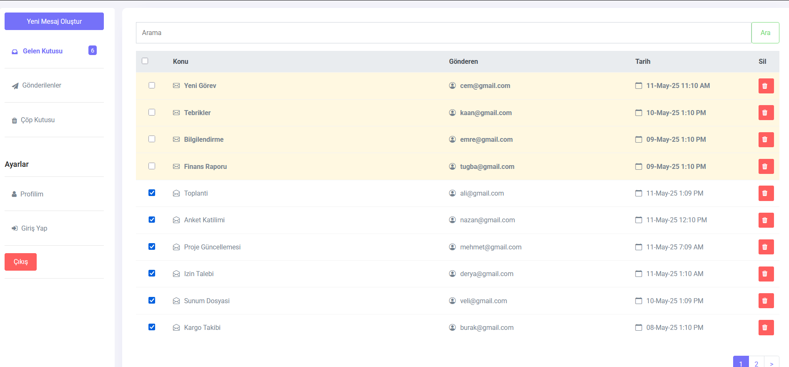
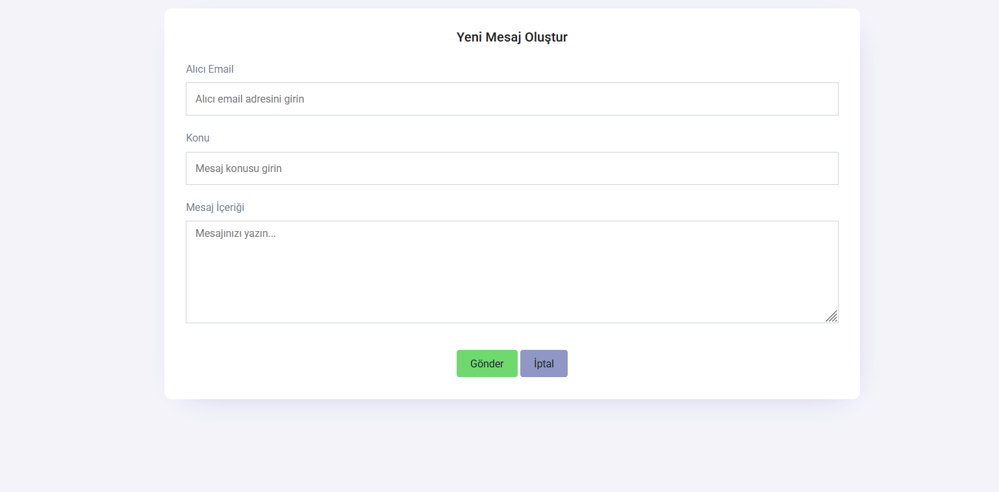
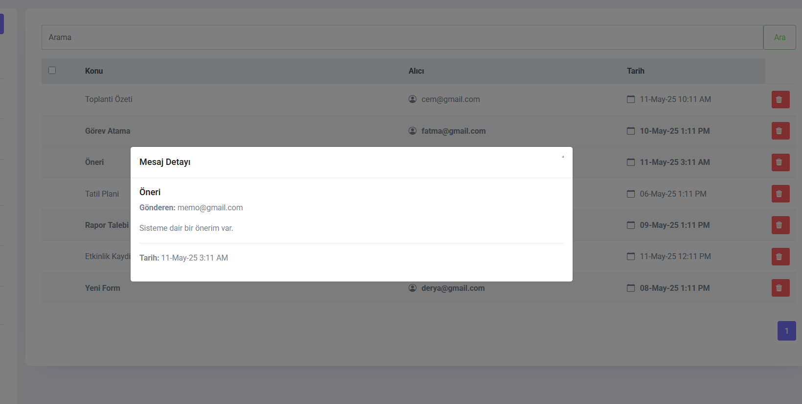
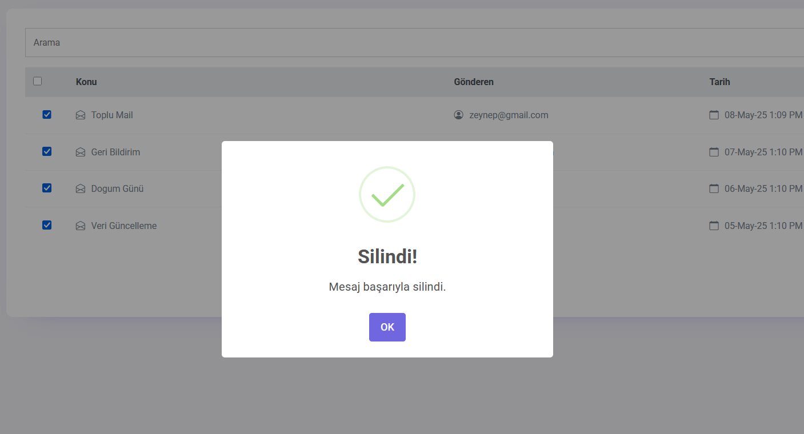
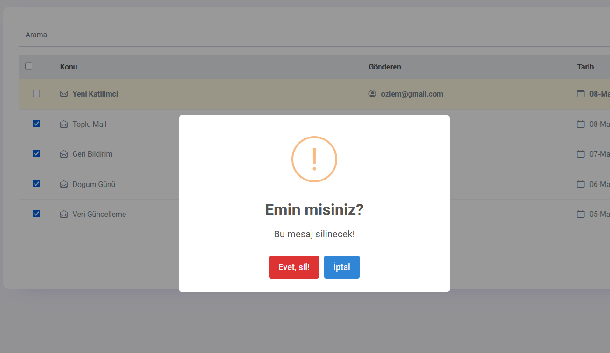

# 📬 ASP.NET Core MVC Messaging App

This repository contains a **simple yet functional messaging web application** developed with **ASP.NET Core MVC**, **Entity Framework Core**, and **Bootstrap**. Users can **send**, **read**, **delete**, and **view details** of messages in a clean and user-friendly interface.

---

## 🖼️ Screenshots

### 📨 Inbox (Gelen Kutusu)

### 📧 Create New Message

### 🔍 Message Details

### ✅ SweetAlert - Success

### ⚠️ SweetAlert - Warning

---

## 🚀 Features

- 📥 **Inbox & Sendbox** views for received and sent messages  
- ✉️ **New Message** creation with subject & content  
- 🗑️ **Delete messages** (soft delete logic with `isDeleted` flag)  
- 📄 **Message details** modal or view  
- 🧭 **Authorization** and session-based protection  
- 🚫 Prevents access to secured pages after logout  
- ⚠️ **SweetAlert** integration for user-friendly alerts  
- 🎨 **Responsive UI** with Bootstrap 5  
- 🗃️ Backend with **Entity Framework Core** and SQL Server  

---

## 🔐 Authentication & Authorization

- ✅ Login required to access Inbox, Sendbox, and message details  
- ❌ After logout, protected pages are no longer accessible  
- 🔒 `[Authorize]` attributes used to secure controllers and actions  
- 🔓 Login and Register pages are marked with `[AllowAnonymous]`

---

## 📦 Technologies Used

- 
- 
- 
- 
- 

---

